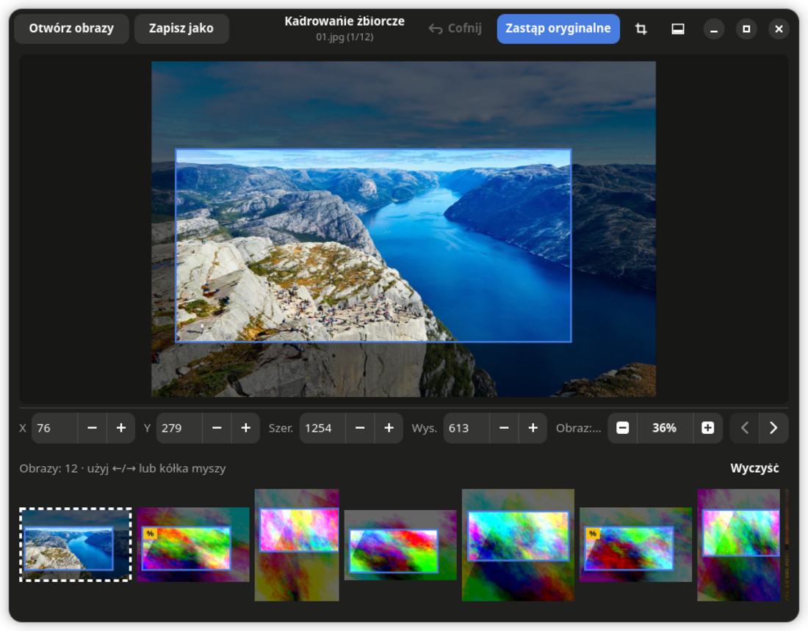
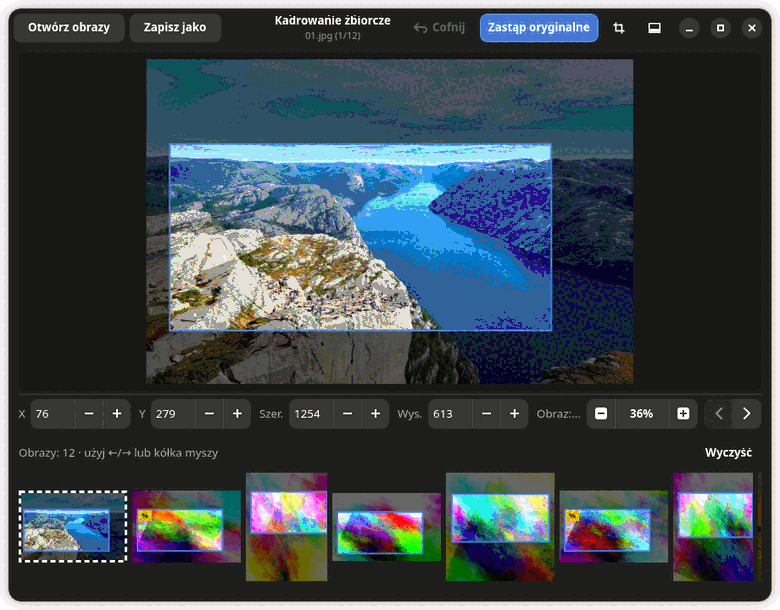
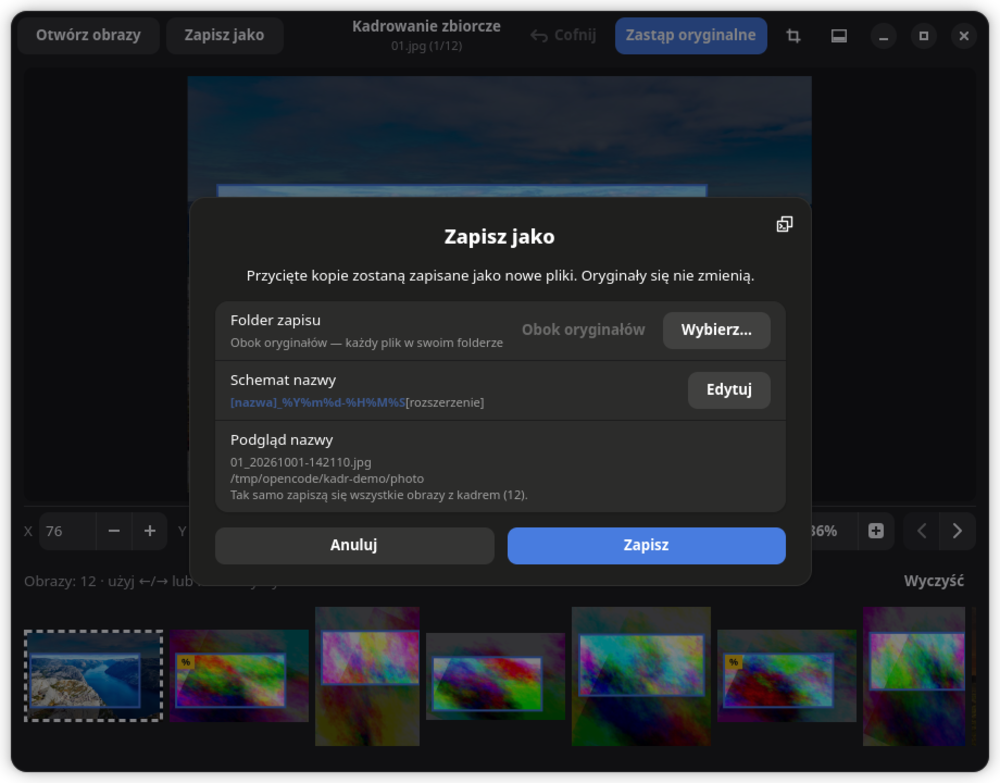

# kadr — kadrowanie zbiorcze

Jeden kadr, wiele obrazów. Wybierasz pliki, przeciągasz ramkę, dostajesz przycięte kopie
wszystkich naraz — zamiast otwierać je po kolei w edytorze.



Program jest jednym plikiem Pythona (`kadr`, ~2800 linii) z GTK4 i libadwaita. Żadnych zależności
poza tym, co i tak ma każdy GNOME.





## Co potrafi

- **Jeden kadr dla całej listy.** Zaznaczasz ramkę raz — dostaje ją każdy wczytany obraz.
- **Kadr indywidualny (`#N`).** Wybrane obrazy dostają wspólny, ale osobny kadr; reszta zostaje na ogólnym.
- **Zaznaczenie nie przeszkadza w przeglądaniu.** Ctrl/Shift+klik zaznacza miniatury, ale `←`/`→`,
  kółko nad panelem i zwykły klik po miniaturach działają normalnie i **nie gubią zaznaczenia** —
  zmienia je tylko Ctrl/Shift, a czyści `Esc` albo *Odznacz*.
- **Skalowanie pod obraz.** Obrazy o tych samych proporcjach co wzorzec dostają proporcjonalnie
  przeskalowany kadr (plakietka `%` na miniaturze) — np. seria zdjęć z aparatu w dwóch rozmiarach.
- **Zapis jako kopie albo w miejscu.** „Zapisz jako” zapisuje przycięte kopie obok oryginałów
  (lub do wybranego folderu), „Zastąp oryginalne” nadpisuje pliki — **z kopią oryginałów i przyciskiem
  „Cofnij”**, który działa też po restarcie programu.
- **Schemat nazwy.** `[nazwa]_%Y%m%d-%H%M%S` domyślnie, plus `[nazwa]`, `[nr]` i kody daty `strftime`.
  Podgląd nazwy w dialogu, a całe polecenie (co przyciąć i pod jaką nazwą) można skopiować do schowka.
- **Dowolny format, jaki zna system.** Czyta to, co czyta gdk-pixbuf; JPEG, PNG, WebP, TIFF, AVIF, HEIF…
  Formaty bez obsługi zapisu idą jako PNG obok oryginału.
- **Wklejanie i upuszczanie.** Ctrl+V (bitmapa albo pliki ze schowka), przeciągnij obrazy na okno,
  albo kliknij puste pole, żeby wybrać pliki.
- **Panel tam, gdzie chcesz.** Na dole, po prawej albo ukryty — uchwytem zmieniasz wysokość
  (liczbę wierszy miniatur) albo szerokość.
- **Sesja wraca.** Kadry, lista obrazów, schemat nazw, pozycja panelu i rozmiar okna zostają
  zapamiętane; po restarcie program jest dokładnie tam, gdzie skończyłeś.

## Instalacja

### Arch (AUR)

```bash
yay -S kadr
```

Repozytorium: <https://aur.archlinux.org/packages/kadr>

### Z repozytorium

```bash
git clone https://github.com/look997/kadr.git
cd kadr
sudo install -Dm755 kadr /usr/bin/kadr
sudo install -Dm644 local.Kadr.desktop /usr/share/applications/local.Kadr.desktop
sudo install -Dm644 local.Kadr.svg /usr/share/icons/hicolor/scalable/apps/local.Kadr.svg
```

Bez uprawnień roota: skopiuj `kadr` na `~/bin/` albo do `~/.local/bin/` i dodaj ją do `PATH`.

### Zależności

`gtk4`, `libadwaita`, `python-gobject`, `python-cairo`, `gdk-pixbuf2`.
Obsługiwane formaty zależą od załadowanych modułów gdk-pixbuf (`gdk-pixbuf2`, `librsvg`, `libheif`, …).

## Użycie

```bash
kadr                    # puste okno
kadr fotki/*.jpg        # od razu z plikami
kadr ~/Obrazy            # cały folder
```

1. **Otwórz obrazy** — przycisk, przeciągnięcie plików na okno albo Ctrl+V.
2. **Przeciągnij ramkę** na obrazie. Kadr można też wpisać liczbowo (X, Y, szerokość, wysokość).
3. **Podgląd**: kółko myszy nad obrazem to zoom, nad panelem — następny obraz.
4. **Zapisz**:
   - *Zapisz jako* — przycięte kopie, nazwa wg schematu. Środkowy przycisk myszy = zapis
     od razu, bez dialogu, ostatnim schematem.
   - *Zastąp oryginalne* — nadpisuje pliki (przedtem kopia oryginału), potem *Cofnij*.

### Skróty i mysz

| Klawisz / gest | Działanie |
|---|---|
| `Ctrl+V` | wklej obrazy lub pliki ze schowka |
| `Ctrl+A` | zaznacz wszystkie miniatury |
| `Esc` | odznacz zaznaczenie |
| `←` `→` | poprzedni / następny obraz (przytrzymane = przewijanie) |
| `↑` `↓` `+` `−` | zoom |
| kółko nad obrazem | zoom |
| kółko poza obrazem | następny / poprzedni obraz |
| prawy / środkowy przycisk na obrazie | przesuwanie powiększonego obrazu |
| środkowy przycisk na miniaturze | pokaż plik w menedżerze plików |
| środkowy przycisk na *Zapisz jako* | szybki zapis bez dialogu |
| `Ctrl`/`Shift` + klik miniaturą | dodawanie/usuwanie z zaznaczenia wielu obrazów (do kadrów `#N`) — sama nawigacja zaznaczenia nie kasuje |

### Pliki programu

| Ścieżka | Co zawiera |
|---|---|
| `~/.config/kadr/state.json` | sesja: kadry, lista obrazów, schemat nazw, układ okna |
| `~/.cache/kadr/undo/` | kopie oryginałów do *Cofnij* |
| `~/.cache/kadr/pasted/` | obrazy wklejone ze schowka (sprzątane po 7 dniach) |

## Budowanie pakietu AUR

```bash
git clone https://aur.archlinux.org/kadr.git
cd kadr
makepkg -si
```

## Uwagi

- **Zastąp oryginalne** nigdy nie nadpisuje pliku bez wcześniejszej kopii — a gdy zapis się nie uda,
  oryginał wraca na miejsce, a błędy pokazuje trwały toast z przyciskiem „Szczegóły”.
- Kadrowanie „w miejscu” nie nadpisuje formatu, którego system nie umie zapisać — zapisuje PNG obok.
- Program nie wysyła nic do sieci i nie dotyka plików poza tymi, które sam wczytasz lub wklejasz.

## Licencja

MIT — [LICENSE](LICENSE).

Zdjęcia w `demo.gif` pochodzą z [picsum.photos](https://picsum.photos).